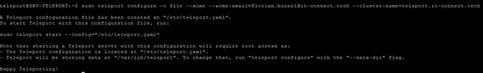
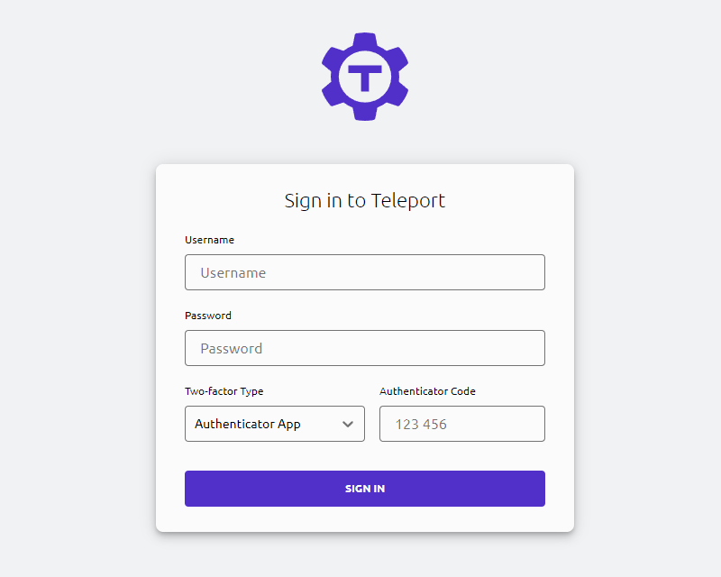
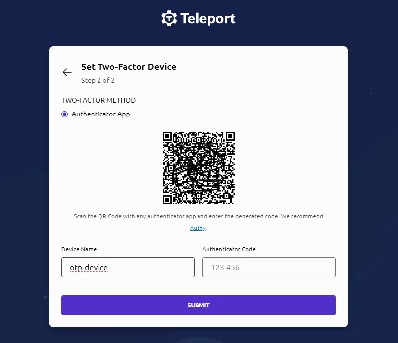

# Bastion d'administration avec Teleport (Debian)

Ce guide décrit l'installation et la mise en service de **Teleport 14.1.1** sur une VM Debian.

- Serveur Teleport : **192.168.10.48**
- Objectif : installer Teleport, générer `/etc/teleport.yaml`, démarrer le service et créer un premier compte administrateur.

Les commandes ci-dessous correspondent à celles utilisées pendant le TP.

---
## 1) Pourquoi nous avons choisi Teleport ?
Teleport est une solution open source de bastion SSH et d'accès distant sécurisé, offrant plusieurs avantages :
- **Sécurité renforcée** : Authentification multi-facteurs, gestion des accès basée sur les rôles (RBAC) et journalisation complète des sessions.
- **Facilité de gestion** : Interface web intuitive pour la gestion des utilisateurs et des accès
- **Accès unifié** : Permet d'accéder à divers services (SSH, bases de données, applications Kubernetes) via une seule plateforme.
---

## 2) Prérequis

- Une VM Debian (ex : Debian 12/13) à jour
- Un compte avec `sudo`
- Depuis le poste d'administration, accès réseau vers votre VM sur les ports nécessaires (voir ci-dessous)

### Ports à autoriser

Sur le serveur Teleport, prévoir l'accès aux ports suivants (valeurs par défaut) :

- TCP 443 : interface Web (Teleport Proxy)
- TCP 3025 : Teleport Auth Service
- TCP 3022 : proxy SSH (accès SSH via Teleport)
- TCP 3024 : reverse tunnel (selon les cas)

---

## 3) Installation de Teleport

### 3.1 Mise à jour des paquets

```bash
sudo apt update
sudo apt upgrade
```

### 3.2 Installation de curl

```bash
sudo apt install curl
```

### 3.3 Installation de Teleport 14.1.1

```bash
sudo curl https://goteleport.com/static/install.sh | bash -s 14.1.1
```

Contrôle (optionnel) :

```bash
teleport version
tctl version
tsh version
```

---

## 4) Génération de la configuration

### 4.1 Création du fichier /etc/teleport.yaml

Commande utilisée :

```bash
sudo teleport configure -o file \
  --acme \
  --acme-email=mail_aux_choix@gmail.com \
  --cluster-name=<votre_IP_ou_nom_de_domaine>
```

Normalement vous étes senser obtenir cette image :




Le fichier de configuration est généré ici :

- `/etc/teleport.yaml`

Extrait attendu (indicatif) :

```yaml
version: v3

teleport:
  nodename: Bastion
  data_dir: /var/lib/teleport

auth_service:
  enabled: "yes"
  listen_addr: 0.0.0.0:3025
  cluster_name: <votre_IP_ou_nom_de_domaine>
  proxy_listener_mode: multiplex

ssh_service:
  enabled: "yes"

proxy_service:
  enabled: "yes"
  web_listen_addr: 0.0.0.0:443
  public_addr: <votre_IP_ou_nom_de_domaine>:443
  https_keypairs: []
  https_keypairs_reload_interval: 0s
  acme:
    email: mail_aux_choix@gmail.com
```

---

## 5) ACME (Let's Encrypt) : recommandations en réseau privé

### 5.1 À quoi sert l'option --acme ?

L'option `--acme` demande à Teleport d'obtenir automatiquement un certificat TLS via **Let's Encrypt**.

En production (nom de domaine public, serveur joignable depuis Internet), c'est très pratique : vous obtenez un certificat valide sans gestion manuelle.

### 5.2 Pourquoi cela peut empêcher d'accéder à Teleport

Dans un lab, avec une IP privée comme **192.168.10.48** (ou sans nom de domaine public), la validation Let's Encrypt ne peut généralement pas aboutir.

Conséquences possibles :

- Teleport tente d'obtenir le certificat, échoue, puis retente.
- Tant que le certificat n'est pas émis, le proxy peut ne pas exposer l'interface Web comme prévu, ce qui donne l'impression que l'accès est “bloqué”.

En clair : ACME implique une validation externe. Si le serveur n'est pas joignable dans les conditions attendues, l'obtention du certificat échoue et perturbe la mise en service.

### 5.3 Désactiver ACME dans la configuration

Éditer le fichier :

```bash
sudo nano /etc/teleport.yaml
```

Dans la section `proxy_service`, désactivez ACME (au choix) :

- soit en retirant le bloc `acme:`
- soit en le forçant à vide

Exemple minimal (ACME désactivé) :

```yaml
proxy_service:
  acme: {}
```

Après modification, redémarrez Teleport :

```bash
sudo systemctl restart teleport
```

---

## 6) Activer et démarrer Teleport

Commandes utilisées :

```bash
sudo systemctl enable teleport
Created symlink /etc/systemd/system/multi-user.target.wants/teleport.service → /lib/systemd/system/teleport.service.
sudo systemctl start teleport
```

---

## 7) Consulter les logs (en cas d'erreur)

```bash
sudo journalctl -u teleport -f
```

---

## 8) Créer le compte administrateur

Commande utilisée :

```bash
sudo tctl users add admin --roles=editor,access --logins=admin,Administrateur,user
```

Cette commande renvoie un lien d'invitation, ouvrez-le dans un navigateur afin de définir le mot de passe :
```
User "admin.fb" has been created but requires a password. Share this URL with the user to complete user setup, link is valid for 1h:
https://teleport.it-connect.tech:443/web/invite/46d49a7b4456c5421a2628bdcabe41c4
NOTE: Make sure teleport.it-connect.tech:443 points at a Teleport proxy which users can access.
```
Vérifier les utilisateurs existants :

```bash
sudo tctl users ls
```

---

## 9) Accéder à l'interface Web

En configuration standard, l'interface Web est accessible ici :

- https://192.168.10.48/

Si le navigateur affiche un avertissement TLS, c'est normal tant que vous n'utilisez pas un certificat reconnu (cas fréquent en environnement de test).

## 10) Configuration du MFA (optionnel)
Aprés avoir passer la 1er étapes de connexion **username/password**, Teleport vous propose de configurer le MFA (Multi-Factor Authentication).



Vous pouvez utiliser une application comme **Google Authenticator** ou **Authy** pour scanner le QR code et générer les codes temporaires.
Après configuration, à chaque connexion vous devrez fournir le code MFA en plus de votre mot de passe.
---
## 11) Ressources a ajouter sur le bastion Teleport

Vous devrez ajouter des ressources (nœuds SSH, bases de données, clusters Kubernetes, etc. selon vos besoins) à votre bastion Teleport pour permettre aux utilisateurs d'y accéder via l'interface Web ou le client `tsh`.

Ressources courantes :
- Nœuds SSH : Ajouter des serveurs Linux/Unix pour l'accès SSH.
- Bases de données : Connecter des bases de données (PostgreSQL, MySQL, etc.) pour un accès sécurisé.
- Clusters Kubernetes : Intégrer des clusters Kubernetes pour la gestion des accès.

Dans notre cas nous utiliserons les ressources suivantes :
- Nœuds SSH : les autres serveurs Debian du lab ( server de sauvegarde, serveur web, serveur BD )
- Debian 8+ intègre nativement le client Teleport (`tsh`), vous pouvez donc configurer les nœuds SSH en installant Teleport en mode "node" et en les enregistrant auprès du serveur Teleport principal (bastion).
- Bases de données : le serveur PostgreSQL du lab