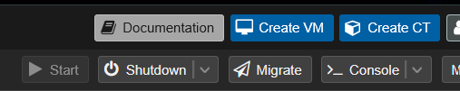
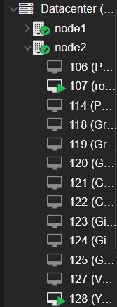

# Création de la VM

## Sur Proxmox, voici les étapes à suivre pour créer une VM Pfsense :

###  Cliquez sur   VM en haut à droite de vote superviseur Proxmox

### Vous devrez ensuite suivre les paramètres d'installation classiques (comme sur une VM VirtualBox).

General : Choisissez la node que vous préférez, l'ID de votre VM, son nom, et enfin, un resource pool commun à tout vos VMs futures.  
OS : Laissez tout par défaut, et choisissez l'iso de PfSense préalablement téléchargée dans la section ISO image. Dans ce cas, j'utilise || pfSense-CE-2.7.2-RELEASE-amd64.iso ||  
System : Tout par défaut  
Disks : Tout par défaut  
CPU : Je met 2 cores  
Memory : 4096 (2048 de RAM étant souvent trop faible)  
Network : Je choisi vmbr0. Nous ajoutons les autres réseaux plus tard.  
Confirm :  

Cliquez ensuite sur Finish.  

Vous devriez dès à présent apercevoir votre VM sur le côté gauche, dans la node correspondante.  

A présent nous allons rajouter nos deux Networks nécessaire à la mise en place de notre routeur.  

Séléctionnez la VM créée sur la gauche.  
Cliquez sur la section "Hardware".  
Vous devriez voir cette page :  

Sur cette image, mes réseaux supplémentaires sont déjà fait.  
Vous allez en ajouter en cliquant sur "Add" => "Network Device".  
Puis vous séléctionnerez "vmbr1" avant de cliquer sur "Add".  
Faites de même pour "vmbr2".  

Votre VM est créée ! Passons maintenant à l'installation de Pfsense.
