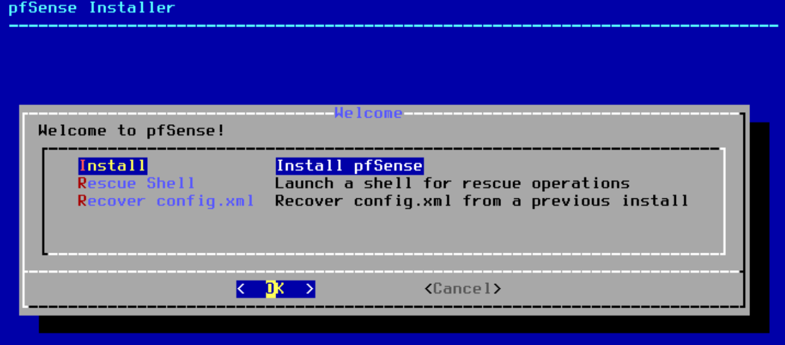
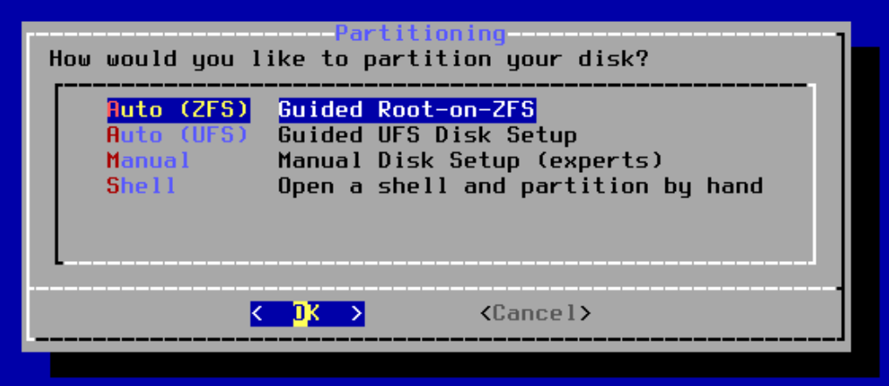
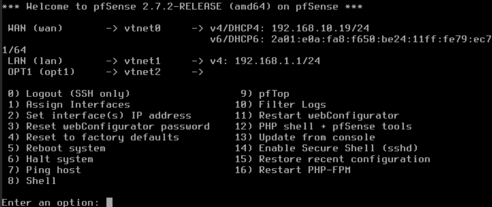

# Installation de Pfsense

Lancez votre VM Pfsense.  
Appuyez sur Entrée sur la première page, qui vous amènera sur celle-ci :   

Vous arriverez sur cette page :

Vous devrez choisir entre l'Auto ZFS ou l'Auto UFS.  
Dans notre cas, nous nous baserons essentiellement sur l'utilisation de la RAM par chacun.  
ZFS en consomme plus et est plus rapide, il nécessite un minimum de 4go de ram, l'idéal étant 8go.  
UFS est très bien pour les petites configurations de moins de 2go de ram. Il est simple et utiliser depuis longtemps. Il n'a pas la fonctionnalité de snapshots comme sur ZFS, mais proxmox est là pour ça.

Ensuite, laissez tout par défaut en appuyant sur Entrée, jusqu'à arriver à cette endroit : 

Appuyez sur Entrée pour reboot la VM.

Plusieurs chose vous serons demandées :

"Should VLANs be set up now ?" => n  
"Enter the WAN interface name" => vtnet0 (correspond à vmbr0)  
"Enter the LAN interface name" => vtnet1 (correspond à vmbr1)  
"Enter the Optional 1 interface name" => vtnet2 (correspond à vmbr2)  
"Do you want to proceed ?" => y  

Une fois démarrée complétement, vous arriverez sur le menu ci-dessous :  

Et voilà ! Votre machine pfsense est installée !  
Il nous reste maintenant à la configurer !